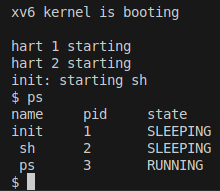

## 🚀 Getting Started

To try out `xv6CustomizeSystemCalls`, clone the repository and compile the code as follows:

```bash
# Clone the repository
git clone https://github.com/rzeta-10/OS-Project.git
cd Project1_xv6CustomizeSystemCalls

# Compile xv6
make qemu

```
## The following are the procedures of adding our exemplary system call ps() to xv6.

 ### Add name to `syscall.h`:
 
 ``` 
 // System call numbers
#define SYS_fork    1
..........
#define SYS_close  21
#define SYS_ps    22
 ``` 
  ### Add function prototype to `defs.h`:
  ``` 
  // proc.c
void            exit(void);
......
void            yield(void);
int             ps ( void ); 
  ```   
 
 ### Add function prototype to `user.h`:
  ``` 
    // system calls
int fork(void);
.....
int uptime(void);
int ps ( void );
   ``` 
     
  ### Add function call to `sysproc.c`:
  
   ``` 
uint64
sys_ps ( void )
{
  return cps ();
}  
   ```
        
   ### Add call to `usys.S`:
   
   ```
  .global ps
ps:
 li a7, SYS_ps
 ecall
 ret
   ```
       
  ### Add call to `syscall.c`:
   
   ```   
extern int sys_chdir(void);
.....
extern int sys_ps(void);
.....
static int (*syscalls[])(void) = {
[SYS_fork]    sys_fork,
.....
[SYS_close]   sys_close,
[SYS_ps]     sys_ps,
};    
   ```
     
     
   ### Add code to `proc.c`:
    
   ``` 
    //current process status
int
ps()
{
struct proc *p;

// Enable interrupts on this processor.
sti();

 // Loop over process table looking for process with pid.
acquire(&wait_lock);
printf("name \t pid \t state \n");
for(p = proc; p < &proc[NPROC]; p++){
   if ( p->state == SLEEPING )
     printf("%s \t %d  \t SLEEPING \n ", p->name, p->pid );
   else if ( p->state == RUNNING )
     printf("%s \t %d  \t RUNNING \n", p->name, p->pid );
    else if ( p->state == RUNNABLE )
      printf("%s \t %d  \t RUNNABLE \n", p->name, p->pid );
      else if ( p->state == ZOMBIE )
      printf("%s \t %d  \t ZOMBIE \n", p->name, p->pid );
      else if ( p->state == USED )
      printf("%s \t %d  \t USED \n", p->name, p->pid );
}

release(&wait_lock);

return 22;
}

   ``` 
 
  ### Create testing file `ps.c` with code shown below:
   ```
#include "kernel/types.h"
#include "kernel/stat.h"
#include "user/user.h"
#include "kernel/fs.h"
#include "kernel/fcntl.h"

int
main(int argc, char *argv[])
{
ps();

exit(0);
}
  
   ```

### `ps` - List Process Status
```bash
ps
```


---
