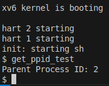
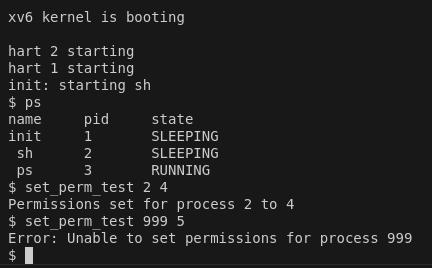

## 🚀 Getting Started

To try out `xv6CustomizeSystemCalls`, clone the repository and compile the code as follows:

```bash
# Clone the repository
git clone https://github.com/rzeta-10/OS-Project.git
cd Project1_xv6CustomizeSystemCalls

# Compile xv6
make qemu

```
## The following are the procedures of adding our exemplary system call ps() to xv6.

 ### Add name to `syscall.h`:
 
 ```c
 // System call numbers
#define SYS_fork    1
..........
#define SYS_close  21
#define SYS_ps    22
 ``` 
  ### Add function prototype to `defs.h`:
  ``` c
  // proc.c
void            exit(void);
......
void            yield(void);
int             ps ( void ); 
  ```   
 
 ### Add function prototype to `user.h`:
  ``` c
    // system calls
int fork(void);
.....
int uptime(void);
int ps ( void );
   ``` 
     
  ### Add function call to `sysproc.c`:
  
   ``` c
uint64
sys_ps ( void )
{
  return cps ();
}  
   ```
        
   ### Add call to `usys.S`:
   
   ```c
  .global ps
 ps:
 li a7, SYS_ps
 ecall
 retSYS_ps
   ```
       
  ### Add call to `syscall.c`:
   
   ``` c
extern int sys_chdir(void);
.....
extern int sys_ps(void);
.....
static int (*syscalls[])(void) = {
[SYS_fork]    sys_fork,
.....
[SYS_close]   sys_close,
[SYS_ps]     sys_ps,
};    
   ```
     
     
   ### Add code to `proc.c`:
    
   ``` c
    //current process status
int
ps()
{
struct proc *p;

// Enable interrupts on this processor.
sti();

 // Loop over process table looking for process with pid.
acquire(&wait_lock);
printf("name \t pid \t state \n");
for(p = proc; p < &proc[NPROC]; p++){
   if ( p->state == SLEEPING )
     printf("%s \t %d  \t SLEEPING \n ", p->name, p->pid );
   else if ( p->state == RUNNING )
     printf("%s \t %d  \t RUNNING \n", p->name, p->pid );
    else if ( p->state == RUNNABLE )
      printf("%s \t %d  \t RUNNABLE \n", p->name, p->pid );
      else if ( p->state == ZOMBIE )
      printf("%s \t %d  \t ZOMBIE \n", p->name, p->pid );
      else if ( p->state == USED )
      printf("%s \t %d  \t USED \n", p->name, p->pid );
}

release(&wait_lock);

return 22;
}

   ``` 
 
  ### Create testing file `ps.c` with code shown below:
   ```c
#include "kernel/types.h"
#include "kernel/stat.h"
#include "user/user.h"
#include "kernel/fs.h"
#include "kernel/fcntl.h"

int
main(int argc, char *argv[])
{
ps();

exit(0);
}
  
   ```

### `ps` - List Process Status
```bash
ps
```


---

## The following are the procedures of adding our exemplary system call fork2() to xv6.

 ### Add name to `syscall.h`:
 
 ``` c
 // System call numbers
#define SYS_fork    1
..........
#define SYS_ps     22
#define SYS_fork2  23
 ``` 
 
 ### Add function prototype to `user.h`:
  ``` c
    // system calls
int fork(void);
.....
int uptime(void);
int fork2(int priority);
   ``` 
     
  ### Add function call to `sysproc.c`:
  
   ``` c
uint64
sys_fork2(void)
{
    int priority;

    argint(0, &priority); 

    return fork_with_priority(priority);
}
 
   ```
        
   ### Add call to `usys.S`:
   
   ```c
  .global fork2
fork2:
 li a7, SYS_fork2
 ecall
 ret
   ```
       
  ### Add call to `syscall.c`:
   
   ```   c
extern int sys_chdir(void);
.....
extern uint64 sys_fork2(void);
.....
static int (*syscalls[])(void) = {
[SYS_fork]    sys_fork,
.....
[SYS_close]   sys_close,
[SYS_fork2]    sys_fork2,
};    
   ```
   ### Add code to `proc.c`:
   ```   c
    int fork_with_priority(int priority);
   ```
   ### Add code to `proc.c`:
    
   ``` c
int fork_with_priority(int priority) {
    struct proc *np;
    struct proc *curproc = myproc();

    // Allocate a new process. This function acquires the process lock.
    if ((np = allocproc()) == 0)
        return -1;

    // Copy the parent process's address space to the child.
    if (uvmcopy(curproc->pagetable, np->pagetable, curproc->sz) < 0) {
        freeproc(np);
        return -1;
    }

    // Set up the new process's state based on the parent process.
    np->sz = curproc->sz;
    np->parent = curproc;
    *np->trapframe = *curproc->trapframe; // Copy the trapframe

    // Set the priority for the new process.
    np->priority = priority;

    // Copy file descriptors from parent to child.
    for (int i = 0; i < NOFILE; i++) {
        if (curproc->ofile[i])
            np->ofile[i] = filedup(curproc->ofile[i]);
    }

    // Copy the current working directory.
    np->cwd = idup(curproc->cwd);
    safestrcpy(np->name, curproc->name, sizeof(curproc->name));

    int pid = np->pid;

    // The process lock is already held here (from allocproc), so we just set the state.
    np->state = RUNNABLE;

    // Release the lock before returning.
    release(&np->lock);

    return pid;
}


   ``` 
 
  ### Create testing file `test_fork2` with code shown below:
   ```c
#include "../kernel/types.h"
#include "user.h"
#include "printf.h"

int main() {
    int pid = fork2(10); // Create a child process with priority 10

    if (pid < 0) {
        printf("fork2 failed\n");
        exit(1);
    }

    if (pid == 0) {
        // This is the child process
        printf("Child process with priority 10\n");
        exit(0);
    } else {
        // Parent waits for the child to finish
        wait(0); // Wait for the child process to complete
        printf("Parent process created child with PID: %d\n", pid);
    }

    exit(0);
}

  
   ```

### `test_fork2` - Creates a 2 child process using fork
```bash
test_fork2
```


---

## The following are the procedures of adding our exemplary system call get_ppid() to xv6.

 ### Add name to `syscall.h`:
 
 ``` c
 // System call numbers
#define SYS_fork    1
..........
#define SYS_fork2  23
#define SYS_get_ppid 24 
 ``` 
  ### Add function prototype to `defs.h`:
  ``` c
  // proc.c
void            exit(void);
......
void            yield(void);
int             ps ( void ); 
  ```   
 
 ### Add function prototype to `user.h`:
  ``` c
    // system calls
int fork(void);
.....
int uptime(void);
int get_ppid(void);

   ``` 
     
  ### Add function call to `sysproc.c`:
  
   ``` c
uint64
sys_get_ppid(void)
{
    struct proc *p = myproc(); // Get the current process
    if (p->parent) {
        return p->parent->pid; // Return parent PID
    }
    return -1; // No parent (e.g., init process)
}
 
   ```
        
   ### Add call to `usys.S`:
   
   ```c
   .global get_ppid
get_ppid:
    li a7, SYS_get_ppid
    ecall
    ret
   ```
       
  ### Add call to `syscall.c`:
   
   ```   c
extern int sys_chdir(void);
.....
extern uint64 sys_get_ppid(void);
.....
static int (*syscalls[])(void) = {
[SYS_fork]    sys_fork,
.....
[SYS_fork2]    sys_fork2,
[SYS_get_ppid] sys_get_ppid,
};    
   ```
  ### Create testing file `get_ppid_test.c` with code shown below:
   ```c
#include "kernel/types.h"
#include "kernel/stat.h"
#include "user/user.h"

int main(void)
{
    int ppid = get_ppid();
    printf("Parent Process ID: %d\n", ppid);
    exit(0);
}

  
   ```

### `get_ppid` - Get PPID of the current running process
```bash
get_ppid_test
```


---
## The following are the procedures of adding our exemplary system call set_perm_test() to xv6.
## **File Structure**
```
.
├── kernel
│   ├── defs.h          # Permission definitions
│   ├── proc.h          # Added perm_flags to struct proc
│   ├── sysproc.c       # set_perm implementation
│   ├── syscall.c       # Added set_perm to dispatch table
│   └── syscall.h       # Added SYS_set_perm
├── user
│   ├── user.h          # User-space prototype for set_perm
│   ├── usys.S          # Assembly stub for set_perm
│   ├── set_perm_test.c # Test program for set_perm
│   └── ...
├── Makefile            # Added _set_perm_test to UPROGS
├── README.md           # This file
```


## **Features**

- **`set_perm` System Call**:
  - Assigns custom permissions to a process based on its PID.
  - Allows extending xv6 with process-level access control.

---

## **Implementation Steps**

### **1. Add System Call Number**
Define the system call number in `kernel/syscall.h`:
```c
#define SYS_set_perm 23
```

---

### **2. Add Function Prototypes**

#### In `kernel/defs.h`:
```c
int set_perm(int pid, int perm_flags);
```

#### In `user/user.h`:
```c
int set_perm(int pid, int perm_flags);
```

---

### **3. Implement the Kernel Function**
#### File: `kernel/sysproc.c`
```c
uint64
sys_set_perm(void)
{
    int pid, perm_flags;

    // Retrieve arguments using argint
    argint(0, &pid);
    argint(1, &perm_flags);

    struct proc *p;

    // Loop through the process table to find the process with the given PID
    for (p = proc; p < &proc[NPROC]; p++) {
        if (p->pid == pid) {
            p->perm_flags = perm_flags;  // Set the permission flags
            return 0;  // Success
        }
    }

    return -1;  // Process not found
}
```

---

### **4. Add the Permission Field**
#### File: `kernel/proc.h`
Add a new field to `struct proc`:
```c
struct proc {
    ...
    int perm_flags;  // Permissions for the process
};
```

---

### **5. Update the System Call Table**
#### File: `kernel/syscall.c`
1. Declare the system call:
   ```c
   extern uint64 sys_set_perm(void);
   ```

2. Add it to the `syscalls` array:
   ```c
   [SYS_set_perm] sys_set_perm,
   ```

---

### **6. Add the Assembly Stub**
#### File: `user/usys.S`
```asm
.global set_perm
set_perm:
    li a7, SYS_set_perm
    ecall
    ret
```

---

### **7. Create a Test Program**
#### File: `user/set_perm_test.c`
```c
#include "kernel/types.h"
#include "kernel/stat.h"
#include "user/user.h"

int main(int argc, char *argv[])
{
    if (argc != 3) {
        printf("Usage: set_perm <pid> <perm_flags>\n");
        exit(1);
    }

    int pid = atoi(argv[1]);
    int perm_flags = atoi(argv[2]);

    if (set_perm(pid, perm_flags) < 0) {
        printf("Error: Unable to set permissions for process %d\n", pid);
    } else {
        printf("Permissions set for process %d\n", pid);
    }

    exit(0);
}
```

---

### **8. Update the Makefile**
Add the test program to the user programs in the `Makefile`:
```makefile
UPROGS = \
    ...
    $U/_set_perm_test \
```

---

## **Build and Test**

1. **Build xv6:**
   ```bash
   make qemu
   ```

2. **Run the Test Program:**
   Inside the xv6 shell:
   ```bash
   $ set_perm_test <pid> <perm_flags>
   ```

---

## **Expected Output**

- If the process exists:
  ```
  Permissions set for process <pid>
  ```
- If the process does not exist:
  ```
  Error: Unable to set permissions for process <pid>
  ```

---
---

### **Example Output**
Below is the output of running the `set_perm_test` program in the xv6 shell:

#### **If the process exists:**
```bash
$ set_perm_test 2 4
Permissions set for process 2
```

#### **If the process does not exist:**
```bash
$ set_perm_test 999 5
Error: Unable to set permissions for process 999
```

#### **Screenshot of Output:**



---
