# 🐚 `csh` - A Custom Shell in C

Welcome to **`csh`**, a custom shell written in C that brings the power of basic UNIX-like commands right to your fingertips! Designed to provide a smooth and intuitive command-line experience, `csh` supports essential file and text manipulation commands, making it a great project for exploring low-level system programming.

## ✨ Features

- **Built-in Commands**: 
  - **`ls`** - List directory contents
  - **`cat`** - Display file contents
  - **`grep`** - Search for patterns within files
  - **`wc`** - Count words, lines, and characters in files
  - **`mv`** - Move or rename files
  - **`rm`** - Remove files

## 🚀 Getting Started

To try out `Csh`, clone the repository and compile the code as follows:

```bash
# Clone the repository
git clone https://github.com/rzeta-10/OS-Project.git
cd Project2_Csh

# Compile the shell program
make clean
make

# Run the shell
./cshell
```

## 🛠️ Usage

Once `csh` is running, you can start using the supported commands just as you would in a typical UNIX shell. Here are a few examples with images of each command in action:


---

### `ls` - List directory contents
```bash
ls
```


### `ls -l` - List directory contents with detailed information
```bash
ls -l
```
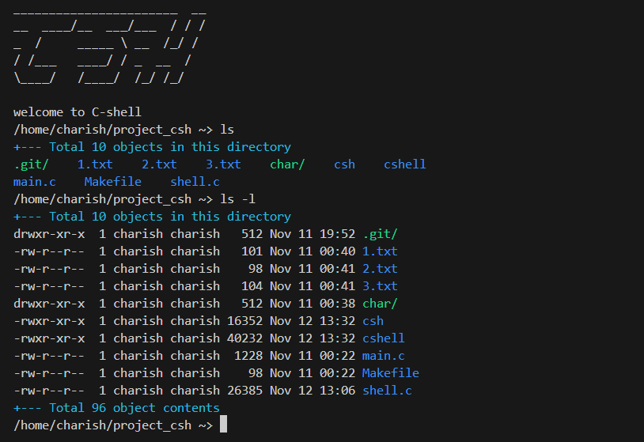

### `cat` - Display contents of a file
```bash
cat filename.txt
```
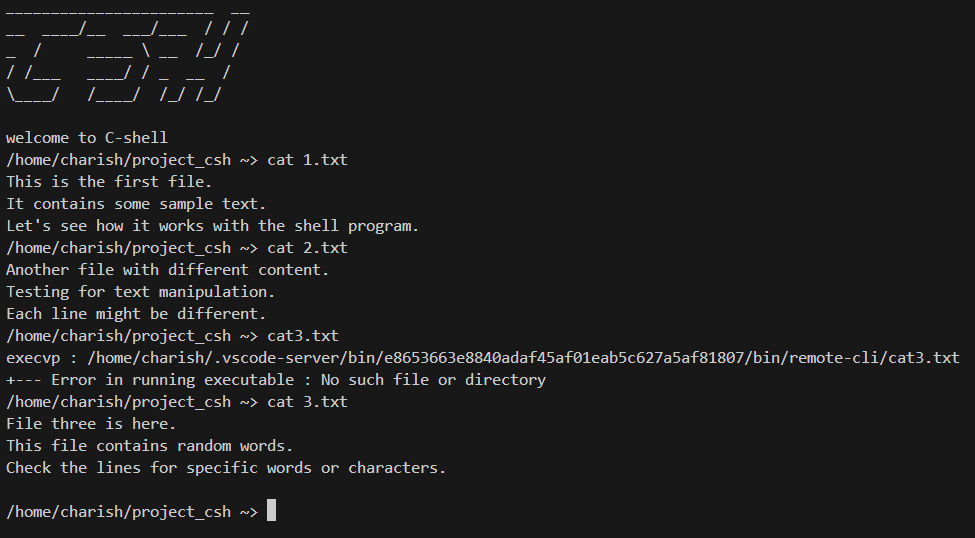

### `grep` - Search for patterns within files
```bash
grep 'pattern' filename.txt
```
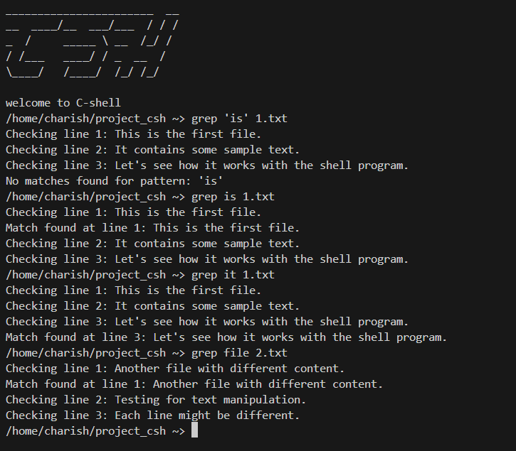

### `wc` - Count lines, words, and characters in a file
```bash
wc filename.txt
```
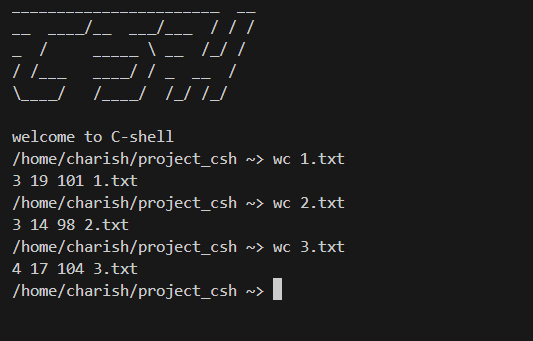

---

Make sure to replace `images/ls_l.png` with the correct path to the screenshot or image file you want to display for the `ls -l` command.

### `mv` - Move or rename a file
```bash
mv oldname.txt newname.txt
```
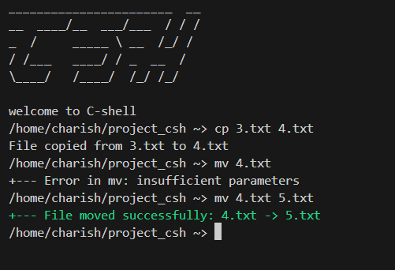

### `rm` - Delete a file
```bash
rm filename.txt
```
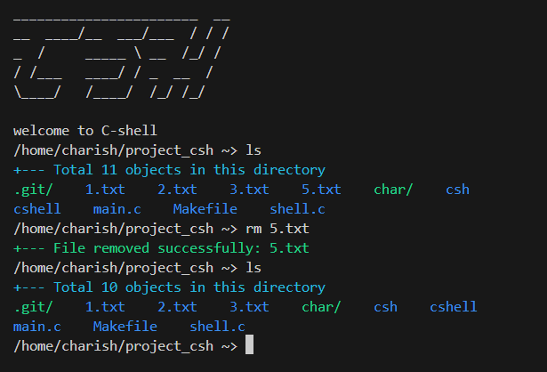

### `date` - Display the current date and time
```bash
date
```
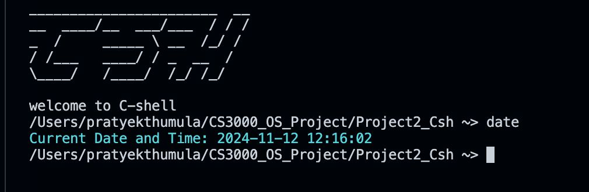

### `calc` - Perform arithmetic calculations
```bash
calc 10 + 5
calc 15 / 3
calc 7 * 8
```


### `todo` - Manage a to-do list
```bash
todo add "Finish homework"
todo list
todo delete 1
```
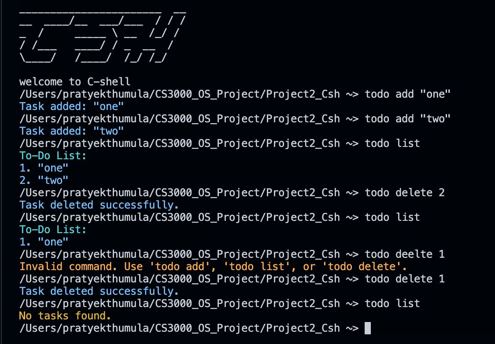

### `touch` - create a file
```bash
touch filename 
```
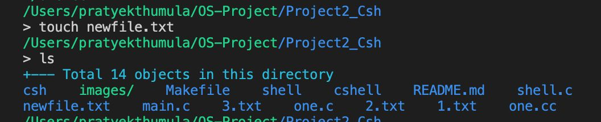


### `df` - 
```bash
df 
```
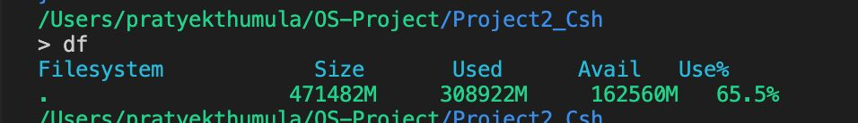

### `head` - output first 5 lines
```bash
head filename
```
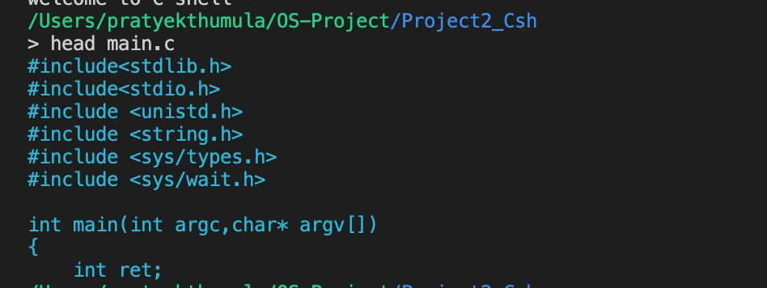

### `tail` - output last 5 lines
```bash
tail filename
```
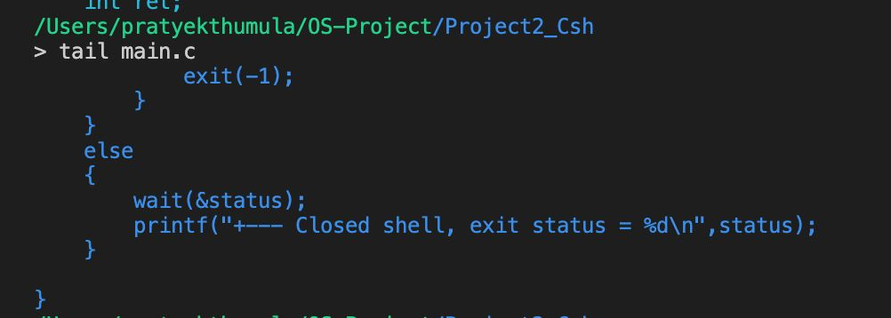

### `find` - search for patterns within filename
```bash
find . "pattern"
```
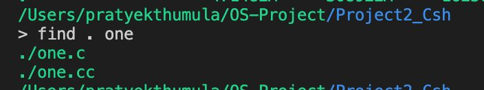

## 📚 Project Structure

- **`main.c`** - Launches a new terminal instance and executes the custom shell `shell.c`
- **`shell.c`** - Core implementation of the shell.
- **`Makefile`** - For building the project with ease.
- **`README.md`** - You’re reading it!

## 🤖 Built With

- **C** - For low-level system programming and managing system calls.
- **UNIX System Calls** - For executing commands, handling files, and managing processes.

## 💡 Why `csh`?

This project is a deep dive into understanding how a shell operates at a fundamental level, making it a great hands-on experience with system-level programming. It’s compact, practical, and covers essential shell functionality, perfect for anyone curious about what goes on behind the scenes of a command-line interface.

---
