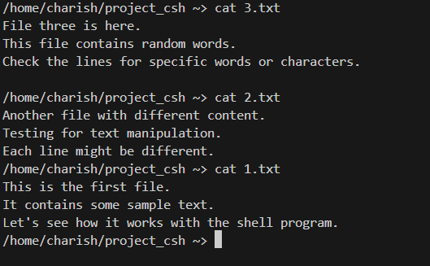

# Operating System Project 🚀

---

## Group Members 👥 

1. Rohan G - CS22B1093

2. Reddipalli Sai Charish - CS22B1095

3. Thumula Pratyek - CS22B1096

4. G Vivek Vardhan Reddy - CS22B1097

---

# Question 1: 

## On Progress ⏳

---

# Question 2: UNIX-like shell program

# 🐚 `csh` - A Custom Shell in C

Welcome to **`csh`**, a custom shell written in C that brings the power of basic UNIX-like commands right to your fingertips! Designed to provide a smooth and intuitive command-line experience, `csh` supports essential file and text manipulation commands, making it a great project for exploring low-level system programming.

## ✨ Features

- **Built-in Commands**: 
  - **`ls`** - List directory contents
  - **`cat`** - Display file contents
  - **`grep`** - Search for patterns within files
  - **`wc`** - Count words, lines, and characters in files
  - **`mv`** - Move or rename files
  - **`rm`** - Remove files

## 🚀 Getting Started

To try out `csh`, clone the repository and compile the code as follows:

```bash
# Clone the repository
git clone https://github.com/yourusername/csh.git
cd csh

# Compile the shell program
make

# Run the shell
./csh
```

## 🛠️ Usage

Once `csh` is running, you can start using the supported commands just as you would in a typical UNIX shell. Here are a few examples with images of each command in action:

### `ls` - List directory contents
```bash
ls
```


### `cat` - Display contents of a file
```bash
cat filename.txt
```


### `grep` - Search for patterns within files
```bash
grep 'pattern' filename.txt
```


### `wc` - Count lines, words, and characters in a file
```bash
wc filename.txt
```


### `mv` - Move or rename a file
```bash
mv oldname.txt newname.txt
```


### `rm` - Delete a file
```bash
rm filename.txt
```


## 📚 Project Structure

- **`main.c`** - Launches a new terminal instance and executes the custom shell `shell.c`
- **`shell.c`** - Core implementation of the shell.
- **`Makefile`** - For building the project with ease.
- **`README.md`** - You’re reading it!

## 🤖 Built With

- **C** - For low-level system programming and managing system calls.
- **UNIX System Calls** - For executing commands, handling files, and managing processes.

## 💡 Why `csh`?

This project is a deep dive into understanding how a shell operates at a fundamental level, making it a great hands-on experience with system-level programming. It’s compact, practical, and covers essential shell functionality, perfect for anyone curious about what goes on behind the scenes of a command-line interface.

---
