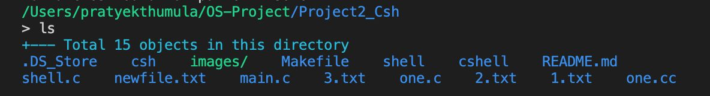
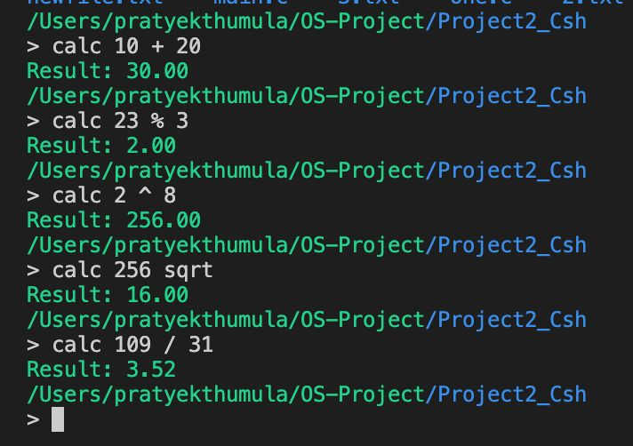
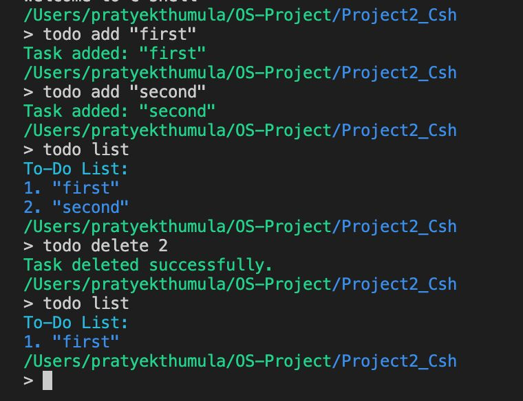
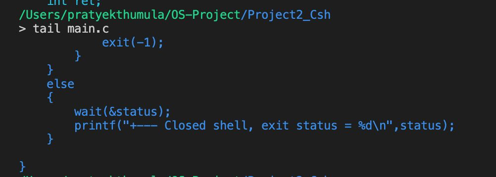
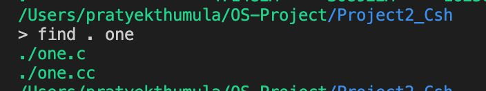

# CS_3003-Operating System Project 🚀

---
This project was developed as part of a course project for CS3003_Operating Systems.
---

## **Group Members** 👥

- **Rohan G** - CS22B1093  
- **Reddipalli Sai Charish** - CS22B1095  
- **Thumula Pratyek** - CS22B1096  
- **G Vivek Vardhan Reddy** - CS22B1097  

---

---

# Question 1:

## 🚀 Getting Started

To try out `xv6CustomizeSystemCalls`, clone the repository and compile the code as follows:

```bash
# Clone the repository
git clone https://github.com/rzeta-10/OS-Project.git
cd Project1_xv6CustomizeSystemCalls

# Compile xv6
make qemu

```
## The following are the procedures of adding our exemplary system call ps() to xv6.

 ### Add name to `syscall.h`:
 
 ``` 
 // System call numbers
#define SYS_fork    1
..........
#define SYS_close  21
#define SYS_ps    22
 ``` 
  ### Add function prototype to `defs.h`:
  ``` 
  // proc.c
void            exit(void);
......
void            yield(void);
int             ps ( void ); 
  ```   
 
 ### Add function prototype to `user.h`:
  ``` 
    // system calls
int fork(void);
.....
int uptime(void);
int ps ( void );
   ``` 
     
  ### Add function call to `sysproc.c`:
  
   ``` 
uint64
sys_ps ( void )
{
  return cps ();
}  
   ```
        
   ### Add call to `usys.S`:
   
   ```
  .global ps
 ps:
 li a7, SYS_ps
 ecall
 retSYS_ps
   ```
       
  ### Add call to `syscall.c`:
   
   ```   
extern int sys_chdir(void);
.....
extern int sys_ps(void);
.....
static int (*syscalls[])(void) = {
[SYS_fork]    sys_fork,
.....
[SYS_close]   sys_close,
[SYS_ps]     sys_ps,
};    
   ```
     
     
   ### Add code to `proc.c`:
    
   ``` 
    //current process status
int
ps()
{
struct proc *p;

// Enable interrupts on this processor.
sti();

 // Loop over process table looking for process with pid.
acquire(&wait_lock);
printf("name \t pid \t state \n");
for(p = proc; p < &proc[NPROC]; p++){
   if ( p->state == SLEEPING )
     printf("%s \t %d  \t SLEEPING \n ", p->name, p->pid );
   else if ( p->state == RUNNING )
     printf("%s \t %d  \t RUNNING \n", p->name, p->pid );
    else if ( p->state == RUNNABLE )
      printf("%s \t %d  \t RUNNABLE \n", p->name, p->pid );
      else if ( p->state == ZOMBIE )
      printf("%s \t %d  \t ZOMBIE \n", p->name, p->pid );
      else if ( p->state == USED )
      printf("%s \t %d  \t USED \n", p->name, p->pid );
}

release(&wait_lock);

return 22;
}

   ``` 
 
  ### Create testing file `ps.c` with code shown below:
   ```
#include "kernel/types.h"
#include "kernel/stat.h"
#include "user/user.h"
#include "kernel/fs.h"
#include "kernel/fcntl.h"

int
main(int argc, char *argv[])
{
ps();

exit(0);
}
  
   ```

### `ps` - List Process Status
```bash
ps
```


---

## The following are the procedures of adding our exemplary system call fork2 to xv6.

 ### Add name to `syscall.h`:
 
 ``` 
 // System call numbers
#define SYS_fork    1
..........
#define SYS_ps     22
#define SYS_fork2  23
 ``` 
 
 ### Add function prototype to `user.h`:
  ``` 
    // system calls
int fork(void);
.....
int uptime(void);
int fork2(int priority);
   ``` 
     
  ### Add function call to `sysproc.c`:
  
   ``` 
uint64
sys_fork2(void)
{
    int priority;

    argint(0, &priority); 

    return fork_with_priority(priority);
}
 
   ```
        
   ### Add call to `usys.S`:
   
   ```
  .global fork2
fork2:
 li a7, SYS_fork2
 ecall
 ret
   ```
       
  ### Add call to `syscall.c`:
   
   ```   
extern int sys_chdir(void);
.....
extern uint64 sys_fork2(void);
.....
static int (*syscalls[])(void) = {
[SYS_fork]    sys_fork,
.....
[SYS_close]   sys_close,
[SYS_fork2]    sys_fork2,
};    
   ```
   ### Add code to `proc.c`:
   ```   
    int fork_with_priority(int priority);
   ```
   ### Add code to `proc.c`:
    
   ``` 
int fork_with_priority(int priority) {
    struct proc *np;
    struct proc *curproc = myproc();

    // Allocate a new process. This function acquires the process lock.
    if ((np = allocproc()) == 0)
        return -1;

    // Copy the parent process's address space to the child.
    if (uvmcopy(curproc->pagetable, np->pagetable, curproc->sz) < 0) {
        freeproc(np);
        return -1;
    }

    // Set up the new process's state based on the parent process.
    np->sz = curproc->sz;
    np->parent = curproc;
    *np->trapframe = *curproc->trapframe; // Copy the trapframe

    // Set the priority for the new process.
    np->priority = priority;

    // Copy file descriptors from parent to child.
    for (int i = 0; i < NOFILE; i++) {
        if (curproc->ofile[i])
            np->ofile[i] = filedup(curproc->ofile[i]);
    }

    // Copy the current working directory.
    np->cwd = idup(curproc->cwd);
    safestrcpy(np->name, curproc->name, sizeof(curproc->name));

    int pid = np->pid;

    // The process lock is already held here (from allocproc), so we just set the state.
    np->state = RUNNABLE;

    // Release the lock before returning.
    release(&np->lock);

    return pid;
}


   ``` 
 
  ### Create testing file `test_fork2` with code shown below:
   ```
#include "../kernel/types.h"
#include "user.h"
#include "printf.h"

int main() {
    int pid = fork2(10); // Create a child process with priority 10

    if (pid < 0) {
        printf("fork2 failed\n");
        exit(1);
    }

    if (pid == 0) {
        // This is the child process
        printf("Child process with priority 10\n");
        exit(0);
    } else {
        // Parent waits for the child to finish
        wait(0); // Wait for the child process to complete
        printf("Parent process created child with PID: %d\n", pid);
    }

    exit(0);
}

  
   ```

### `test_fork2` - Creates a 2 child process using fork
```bash
test_fork2
```


---

## The following are the procedures of adding our exemplary system call get_ppid() to xv6.

 ### Add name to `syscall.h`:
 
 ``` 
 // System call numbers
#define SYS_fork    1
..........
#define SYS_fork2  23
#define SYS_get_ppid 24 
 ``` 
  ### Add function prototype to `defs.h`:
  ``` 
  // proc.c
void            exit(void);
......
void            yield(void);
int             ps ( void ); 
  ```   
 
 ### Add function prototype to `user.h`:
  ``` 
    // system calls
int fork(void);
.....
int uptime(void);
int get_ppid(void);

   ``` 
     
  ### Add function call to `sysproc.c`:
  
   ``` 
uint64
sys_get_ppid(void)
{
    struct proc *p = myproc(); // Get the current process
    if (p->parent) {
        return p->parent->pid; // Return parent PID
    }
    return -1; // No parent (e.g., init process)
}
 
   ```
        
   ### Add call to `usys.S`:
   
   ```
   .global get_ppid
get_ppid:
    li a7, SYS_get_ppid
    ecall
    ret
   ```
       
  ### Add call to `syscall.c`:
   
   ```   
extern int sys_chdir(void);
.....
extern uint64 sys_get_ppid(void);
.....
static int (*syscalls[])(void) = {
[SYS_fork]    sys_fork,
.....
[SYS_fork2]    sys_fork2,
[SYS_get_ppid] sys_get_ppid,
};    
   ```
  ### Create testing file `get_ppid_test.c` with code shown below:
   ```
#include "kernel/types.h"
#include "kernel/stat.h"
#include "user/user.h"

int main(void)
{
    int ppid = get_ppid();
    printf("Parent Process ID: %d\n", ppid);
    exit(0);
}

  
   ```

### `get_ppid` - Get PPID of the current running process
```bash
get_ppid_test
```


---

# Question 2: UNIX-like shell program

---


# 🐚 `csh` - A Custom Shell in C

Welcome to **`csh`**, a custom shell written in C that brings the power of basic UNIX-like commands right to your fingertips! Designed to provide a smooth and intuitive command-line experience, `csh` supports essential file and text manipulation commands, making it a great project for exploring low-level system programming.

## ✨ Features

- **Built-in Commands**: 
  - **`ls`** - List directory contents
  - **`cat`** - Display file contents
  - **`grep`** - Search for patterns within files
  - **`wc`** - Count words, lines, and characters in files
  - **`mv`** - Move or rename files
  - **`rm`** - Remove files

## 🚀 Getting Started

To try out `Csh`, clone the repository and compile the code as follows:

```bash
# Clone the repository
git clone https://github.com/rzeta-10/OS-Project.git
cd Project2_Csh

# Compile the shell program
make clean
make

# Run the shell
./cshell
```


## 🛠️ Usage

Once `csh` is running, you can start using the supported commands just as you would in a typical UNIX shell. Here are a few examples with images of each command in action:


---

You can use the `Up Arrow (↑)` and `Down Arrow (↓)` keys to navigate through previously executed commands

### `ls` - List directory contents
```bash
ls
```


### `ls -l` - List directory contents with detailed information
```bash
ls -l
```


### `cat` - Display contents of a file
```bash
cat filename.txt
```


### `grep` - Search for patterns within files
```bash
grep 'pattern' filename.txt
```


### `wc` - Count lines, words, and characters in a file
```bash
wc filename.txt
```


---

### `mv` - Move or rename a file
```bash
mv oldname.txt newname.txt
```


### `rm` - Delete a file
```bash
rm filename.txt
```


### `date` - Display the current date and time
```bash
date
```


### `calc` - Perform arithmetic calculations
```bash
calc 10 + 5
calc 15 / 3
calc 7 * 8
```


### `todo` - Manage a to-do list
```bash
todo add "Finish homework"
todo list
todo delete 1
```


### `touch` - create a file
```bash
touch filename 
```


### `df` - Displays disk memory usage
```bash
df 
```


### `head` - output first 5 lines
```bash
head filename
```


### `tail` - output last 5 lines
```bash
tail filename
```


### `find` - search for patterns within filename
```bash
find . "pattern"
```


## 📚 Project Structure

- **`main.c`** - Launches a new terminal instance and executes the custom shell `shell.c`
- **`shell.c`** - Core implementation of the shell.
- **`Makefile`** - For building the project with ease.
- **`README.md`** - You’re reading it!

## 🤖 Built With

- **C** - For low-level system programming and managing system calls.
- **UNIX System Calls** - For executing commands, handling files, and managing processes.

## 💡 Why `csh`?

This project is a deep dive into understanding how a shell operates at a fundamental level, making it a great hands-on experience with system-level programming. It’s compact, practical, and covers essential shell functionality, perfect for anyone curious about what goes on behind the scenes of a command-line interface.

---
